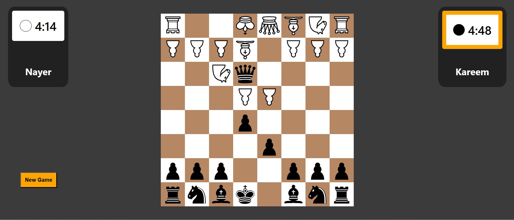
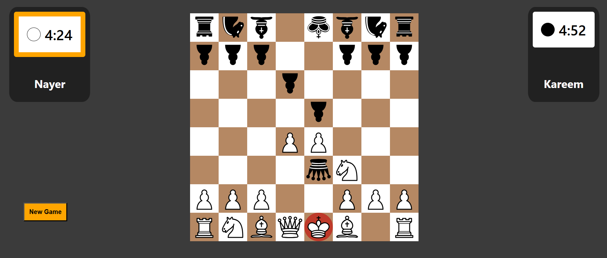
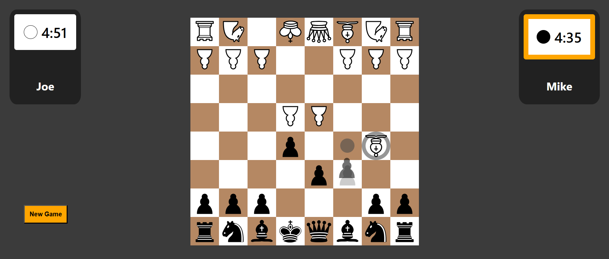
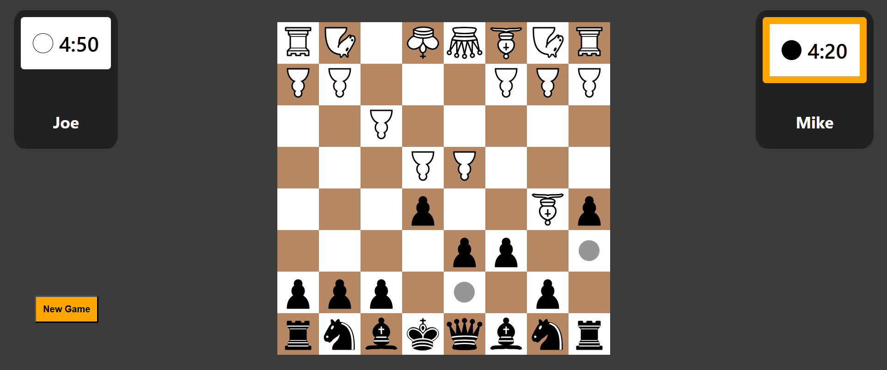

# Chessy - React Chess Game

A two-player chess web app built with React and SCSS, featuring timers, move validation, turn-based board flipping, captured-piece tracking, and a game-over screen.

## Demo

Live URL (update this after deployment):

- https://nayerbasim.github.io/ChessGame

## Screenshots


Home screen where players begin a new match from the main landing page.




Live gameplay view showing timers, pieces, and the active board state.




A check scenario where the king is under immediate threat.




Drag-and-drop interaction used to move a selected piece across the board.



Highlighted legal move options displayed after selecting a piece.


## Features

- 1v1 local play with custom player names
- Configurable game timers (5, 10, 15, or 20 minutes)
- Optional board flip every turn
- Piece movement validation and illegal-move feedback
- Check and checkmate detection
- Castling support
- Captured piece display for both sides
- Drag-and-drop and click-based move interactions
- Local storage persistence for board state, king locations, and current turn
- New Game reset and match end screen

## Tech Stack

- React 18
- React Router 6
- SCSS
- react-timer-hook
- Create React App (react-scripts)

## Getting Started

### Prerequisites

- Node.js 18+ recommended
- npm 9+ recommended

### Installation

```bash
npm install
```

### Run in Development

```bash
npm start
```

Then open http://localhost:3000.

## How to Play

1. Open the app and click PLAY.
2. Choose the game time and enter player names.
3. Optionally disable board flipping.
4. Start the game and play by clicking or dragging pieces.
5. Win by checkmate or by timeout.

## Route / URL Format

Main game route:

- `/game/:time?name1=<player1>&name2=<player2>&flip=<true|false>`

Example:

- `/game/10?name1=Alice&name2=Bob&flip=true`

## Available Scripts

In the project directory:

- `npm start` - Runs the app in development mode
- `npm test` - Launches the test runner
- `npm run build` - Builds a production bundle
- `npm run deploy` - Deploys `build` to GitHub Pages (requires `homepage` config)

## Project Structure

```text
src/
	components/
		ChessBoard/
			helpers/
		ChessPage/
		EndScreen/
		HelperDots/
		Home/
		PieceSelection/
		StartScreen/
		Timer/
	media/
```

## Deployment Notes

1. Update `homepage` in `package.json` with your GitHub Pages URL.
2. Run:

```bash
npm run deploy
```
